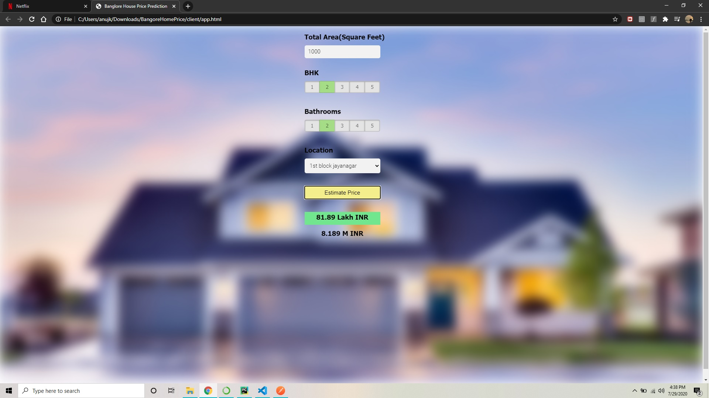

# RealEstate-Price-Prediction
This project predicts the real estate price as per the given features. The dataset which I used was Bengaluru housing price dataset which is available on the Kaggle. I was successfully able to complete the data preprocessing including "Outlier detection", "Feature Engineering" etc. The majority of my time I spent was to clean the data.

After that I used “Grid search” to choose the best model and appropriate parameter for that model. So as per the “Grid search” result I build my model and it gave me 83% accuracy. Then I used PyCharm to setup my Flask local server so that I can run my website and deploy my model locally. I used Visual Studio Code to build my website and, on that website, I deployed my model. Then I used AWS to deploy the same model on the cloud http://ec2-35-174-200-4.compute-1.amazonaws.com/. I terminated the instance as I was just testing my website on the cloud.

